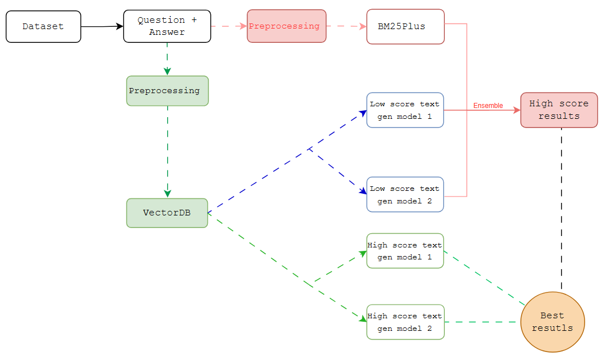
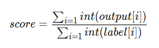

# [KALAPA CHALLENGE _ Vietnamese Medical Question Answering](https://challenge.kalapa.vn/portal/vietnamese-medical-question-answering/leaderboard)

<p align="center">
 
</p>

## Public Score

In the initial stage of the Challenge, a custom scoring metric was employed for evaluation purposes.
<p align="center">
 
</p>


My achieved score stood at 74.04 out of 85.79, positioning me at rank 17 relative to the highest-scoring team. In addition, my accuracy surpassed that of several other teams, equating to a ranking around 9th or 10th place with a score of 0.67 out of 0.7879, compared to the highest accuracy team.

| **Rank**            |        **Team name**          |             **Score**              |           **Accuracy**       |    
|:-------------------:|:-----------------------------:|:----------------------------:|:---------------------------------:|
| **17** |**Thiên Đặng_AIO (me)** |   **0.7404**   | **0.6667** |

### Description

- Currently, with the development of modern language models, many chatbots and language assistants have been built to solve various problems. However, building a Vietnamese language model still faces many limitations.

- In this challenge, participating teams will build a language model capable of answering multiple-choice questions (with one or more correct answers) in the medical field, based on the provided dataset.

## Problem Statement

- The challenge organizers provide data on common diseases, with each disease having from 1 to 2 articles, including information related to causes, symptoms, disease prevention methods, etc.

### Input

- Vietnamese multiple-choice questions, each with 2 to 6 options, with at least one correct option.

### Output

The systems of participating teams need to return answers in binary string format. For each question with n options, you need to return a binary string of length n, where the iii-th element of the binary string is 0 if the iii-th option in the question is incorrect and vice versa. For example, for a question with 5 options A, B, C, D, E; where the correct answers are B, E, the output should be `01001`.

## Instructions

- Ensure your system is capable of processing Vietnamese text effectively.
- Develop a model that can accurately understand and respond to medical questions in Vietnamese.
- Generate binary string outputs based on the correctness of options for each question.
- Aim for high accuracy in answering questions based on the provided dataset.

## Dataset

- The organizers provide data on common diseases, each accompanied by informative articles covering various aspects of the disease, including causes, symptoms, preventive measures, etc.
## Getting started
```
git clone https://github.com/tnt305/kalapa_challenge_2023.git
```
### Installing
`pip install -r requirements.txt`

### Download embedding model me5 from Huggingface and convert to onnx
You can test it with other mutilingual model 
`git clone https://huggingface.co/intfloat/multilingual-e5-small`
`python convert_onnx.py`

### Embed Medical Corpus into Vector Storage
`python embed_corpus.py`

### Run model
You can also test with different model strategy related to prompting and quantization + generation config
```
python main.py --model model_in_the_selection --model_path huggingface_related_model
```

### Anything that you should or want to understand about LLMs

- If you're new to quantization,start by reading [this](https://en.wikibooks.org/wiki/A-level_Computing/AQA/Paper_2/Fundamentals_of_data_representation/Floating_point_numbers#:~:text=In%20decimal%2C%20very%20large%20numbers,be%20used%20for%20binary%20numbers.).
- If you find it hard, consider [this](https://huggingface.co/blog/4bit-transformers-bitsandbytes)
- More about text generation [configuration](https://towardsdatascience.com/decoding-strategies-that-you-need-to-know-for-response-generation-ba95ee0faadc).
- Convert to [Onnx](https://huggingface.co/blog/convert-transformers-to-onnx)
- Different model [performance](https://huggingface.co/MediaTek-Research/Breeze-7B-Instruct-v0_1/blob/main/README.md#chat-model-performance) that you might consider to try on

### Sources:
- The original idea is based [Viet](https://github.com/viethq18/kalapa_vmqa_solution) and [this paper](https://github.com/medmcqa/medmcqa)
